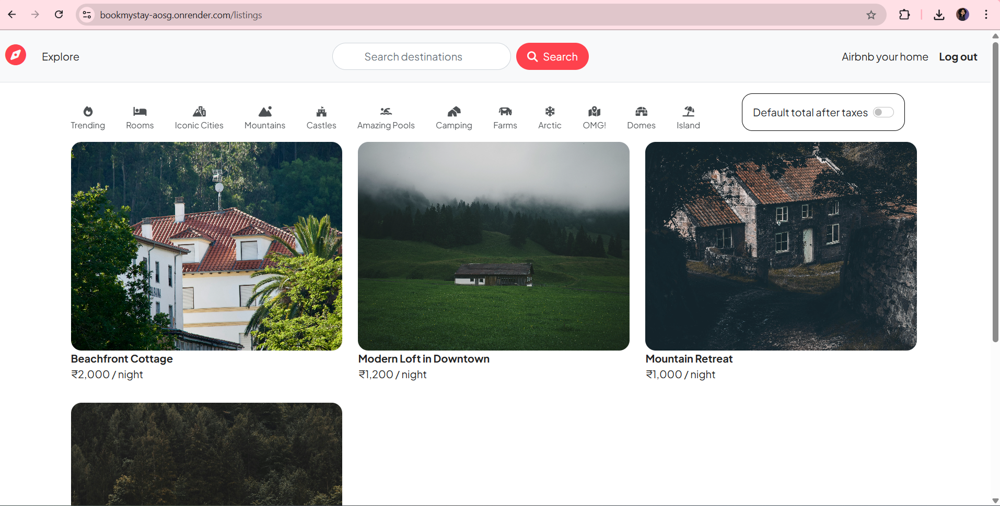
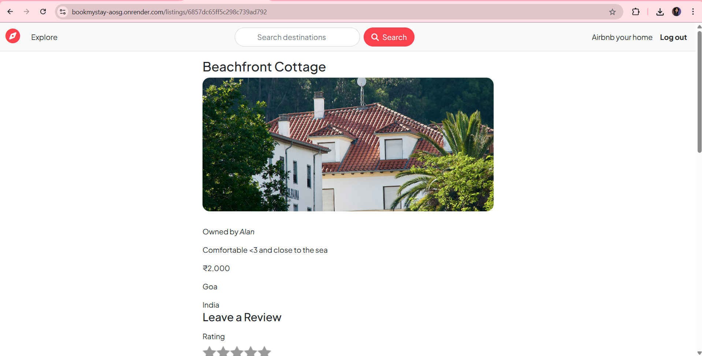
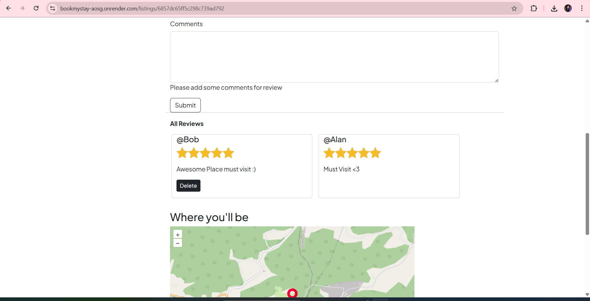
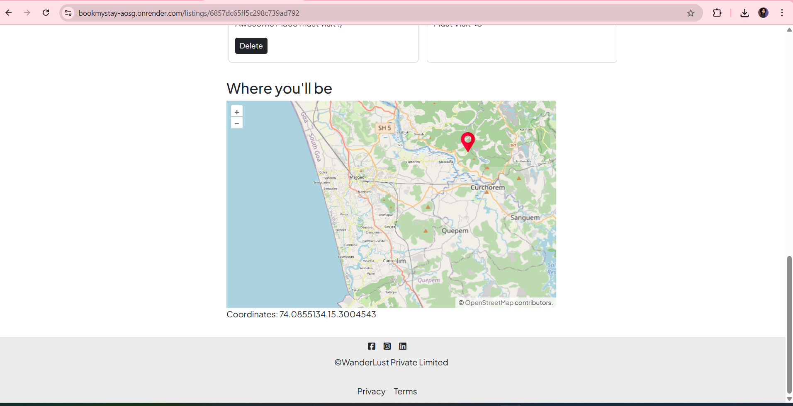
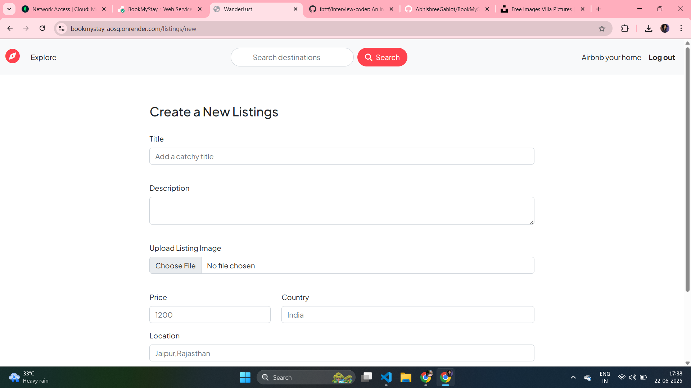

# 🌍 BookMyStaySite
BookMyStay is a full-stack web application that lets users explore, create, and manage vacation property listings — inspired by Airbnb. It features image uploads, reviews, location-based mapping, and secure user authentication.

🛠 Built with the MERN stack ecosystem, EJS templates, Cloudinary, Passport.js, and OpenLayers.

---

## 🔗 Live Website

✨ [Click here to view Wanderlust](https://bookmystay-aosg.onrender.com/listings)

> Deployed and fully functional — explore listings, leave reviews, and browse by location.

---

## 🎬 Demo Video

> 🔍 A quick walkthrough of Wanderlust's core features, user flow, and UI experience.

---

## 📸 Screenshots

|  |
 |
 |
 |
 |

---

## 🚀 Features

- 🔐 **User Authentication** (Register, Login, Logout)
- 🏠 **Create/Edit/Delete Listings**
- 🖼️ **Image Uploads** with Cloudinary
- 🌍 **Geolocation Mapping** using OpenLayers + Nominatim
- 💬 **Reviews System** with permissions
- 📦 **MongoDB Atlas** for storage
- ⚙️ **Session Handling** using connect-mongo
- 🎨 **Responsive UI** with Bootstrap 5
- 📌 **Flash Messages & Custom Error Pages**

---

## 🧰 Tech Stack

| Layer        | Technologies Used                          |
|--------------|---------------------------------------------|
| **Frontend** | EJS, HTML5, CSS3, Bootstrap, JavaScript     |
| **Backend**  | Node.js, Express.js                        |
| **Database** | MongoDB, Mongoose                          |
| **Auth**     | Passport.js, express-session, connect-mongo|
| **Media**    | Multer, Cloudinary                         |
| **Maps**     | OpenLayers, Nominatim API                  |

---
